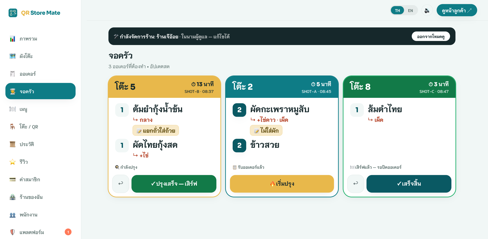
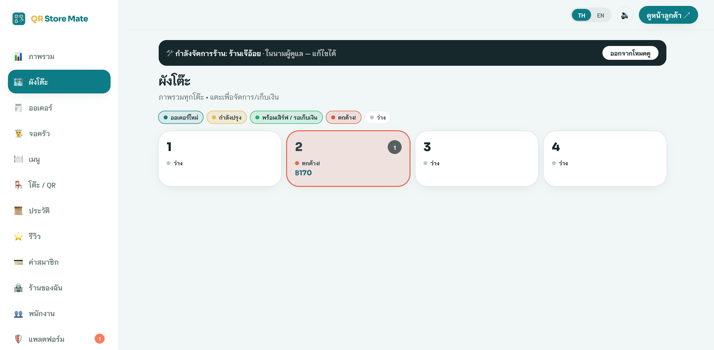
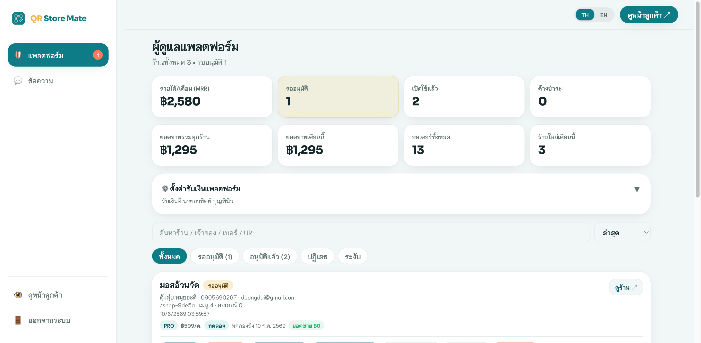
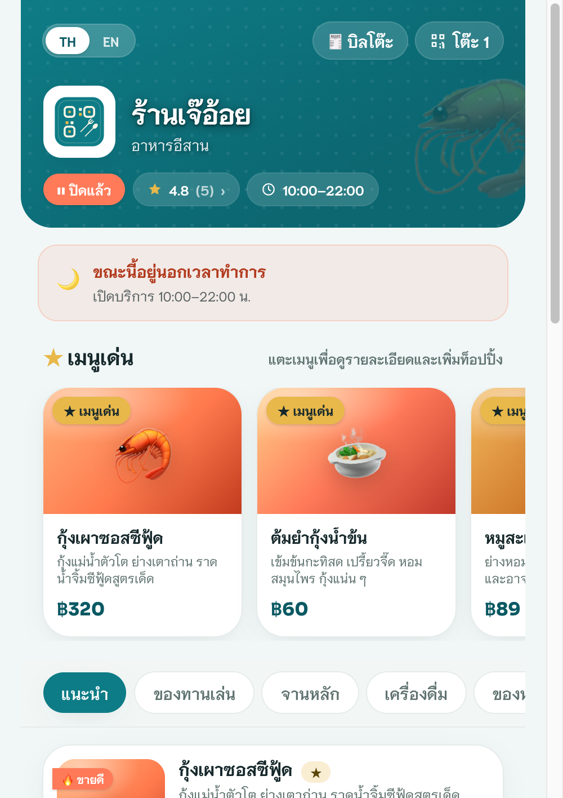
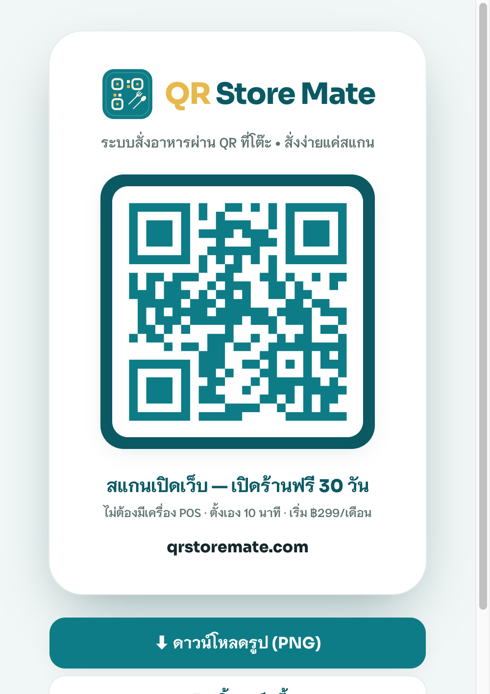

<div align="center">

# 🍽️ QR Store Mate

### Multi-tenant QR dine-in ordering & PromptPay payments for small Thai restaurants

**Customers scan a QR at the table → browse the menu → order → pay — no app install, no POS hardware.**
**Owners get a live kitchen display, floor map, order board, and dashboard from any phone.**

[](https://qrstoremate.com)
&nbsp;


**🌐 Live: [qrstoremate.com](https://qrstoremate.com) · Built & shipped solo, end-to-end (product → design → full-stack → DB → DevOps)**

</div>

---

## 📑 Table of Contents

- [What it is](#-what-it-is)
- [The problem](#-the-problem)
- [Screenshots](#-screenshots)
- [Feature overview](#-feature-overview)
- [Tech stack](#-tech-stack)
- [System architecture](#-system-architecture)
- [Security model](#-security-model-the-hard-part)
- [Realtime architecture](#-realtime-architecture)
- [Performance & scale](#-performance--scale)
- [Engineering highlights](#-engineering-highlights-hard-problems-solved)
- [Data model](#-data-model)
- [Project structure](#-project-structure)
- [Running locally](#-running-locally)
- [Quality & verification](#-quality--verification)
- [Roadmap](#-roadmap)
- [About](#-about)

---

## 🎯 What it is

**QR Store Mate** is a production, multi-tenant SaaS that turns any small restaurant into a self-service QR-ordering venue in ~10 minutes — no point-of-sale hardware, no app download for diners. It is purpose-built for the long tail of Thai eateries, street-food shops and cafés that full POS systems price out.

A diner scans the QR sticker on their table, the menu opens instantly in their phone browser (Thai/English), they order and pay via **PromptPay / bank transfer / co-pay / cash** — while the kitchen sees the ticket the moment it's placed and the floor staff track every table in real time.

| | |
|---|---|
| **Status** | 🟢 Live in production at [qrstoremate.com](https://qrstoremate.com) |
| **Scope** | Solo build — product strategy, UX/UI, frontend, backend, database, security, deployment |
| **Codebase** | ~10,900 lines of TypeScript across 70 files · 30 routes |
| **Backend** | 13 Postgres tables · 34 SECURITY DEFINER RPCs · 35 RLS policies · 52 migrations · 2 edge functions |
| **Model** | Subscription SaaS — Starter ฿299 / Pro ฿599 / Business ฿1,290 per month |

---

## 💡 The problem

Small Thai restaurants run on paper and shouting. Staff sprint between tables and the kitchen, mis-write orders, and lose time at checkout. The existing software answer is a full POS — too expensive, hardware-bound, and overkill for a 10-table noodle shop.

**QR Store Mate removes the hardware and the price barrier:**

- **Diners** self-order from their own phone → fewer mistakes, less waiting, no waitstaff bottleneck.
- **Kitchens** get a live display (KDS) with the exact items, add-ons, spice level and notes the moment an order lands.
- **Owners** manage the whole shop — menu, tables, orders, billing, staff, reviews — from a phone, for the price of a few plates of food a month.

---

## 📸 Screenshots

> **▶️ Try it live (no install, no scan needed):** [qrstoremate.com/r/khrua-khun-nai/t/1](https://qrstoremate.com/r/khrua-khun-nai/t/1) — open it on your phone for the real experience.

### 🍳 Kitchen Display — distance-readable tickets, allergy notes broken out, overdue alerts


### 🗺️ Floor map — every table colour-coded by state, live call badges, tap-to-bill


### 🛡️ Platform super-admin console — tenants, MRR, approvals, view-as


| 📱 Customer menu (mobile) | 🖨️ Printable brand / sales card |
|:---:|:---:|
|  |  |


---

## ✨ Feature overview

### 👤 Customer (anonymous, no login)
- **Scan-to-order** — table-scoped menu via `/r/{shop}/t/{table}`, opens instantly in-browser.
- **Bilingual UI (TH/EN)** with a one-tap language toggle (~190 localized strings).
- **Rich item sheet** — quantity, add-on groups (single/multi select), spice level, free-text notes.
- **One shared table bill** — everyone at the table orders into a single bill; pay once at the end.
- **Live order tracking** — received → cooking → serving → done, pushed in real time.
- **Call staff / call for the bill** — with the chosen payment method sent to the floor.
- **PromptPay QR** generated client-side (valid EMVCo TLV payload + CRC16) with a dynamic amount.
- **Read & write reviews** — star rating + comment, shown back to other diners.
- **Realtime open/closed gating** — ordering auto-locks outside opening hours (Asia/Bangkok, overnight-aware) or when the owner pauses the shop.

### 🍳 Restaurant operations
- **Kitchen Display** — distance-readable tickets (FIFO), large item names, bold quantity badges, allergy/notes broken out into a high-contrast chip, and per-ticket wait timers with an "overdue" alert.
- **Floor map** — every table colour-coded by state (idle / new / cooking / ready / overdue), with live call badges (🔔 staff / 💰 bill + method) and tap-to-bill.
- **Order board** — filter by status, advance/step-back the cook flow, cancel with confirmation.
- **Collect & close the bill** from the floor, orders, or kitchen — including from staff accounts.
- **Audible + voice alerts** — distinct chimes for new orders vs. service calls vs. bill calls, plus **pre-rendered Thai voice announcements** ("โต๊ะ 5 เรียกเก็บเงิน เงินสด") that work reliably on iPad/iOS.

### 🏪 Owner
- **Menu manager** — items, categories, prices, promo prices, photos, sold-out/hidden flags, add-on group editor.
- **Tables & QR** — generate and download printable per-table QR codes (pinned to the canonical domain).
- **Shop profile** — name, cover/logo, opening hours (auto open/close + a manual master switch), PromptPay/bank payout, VAT & co-pay toggles.
- **Order history + CSV export** (UTF-8 BOM, properly escaped) and a sales **dashboard** with a date picker.
- **Staff sub-accounts** (Business plan) — operational-only access (orders/kitchen/floor/reviews), invited via email with secure onboarding.
- **In-app support chat** with the platform team.

### 🛡️ Platform super-admin
- **Tenant console** — approve/reject/suspend shops, search, sort, set plan, mark paid, edit slug, delete.
- **Platform stats** — MRR, active shops, pending approvals, overdue, cross-shop revenue.
- **View-as-admin** — drop into any shop's dashboard to manage or support it.
- **Moderation** — delete individual reviews on any shop (rating auto-recomputed).
- **Cross-shop messaging** inbox.

---

## 🛠 Tech stack

| Layer | Choice | Why |
|---|---|---|
| **Framework** | Next.js 16 (App Router) + React 19 | Server components, file routing, fast DX |
| **Language** | TypeScript 5 (strict) | Type safety across a 70-file codebase |
| **Styling** | Tailwind CSS v4 | Custom teal design system, mobile-first |
| **State** | Zustand 5 | Two lightweight stores (shop + cart) with `persist` |
| **Backend** | Supabase — Postgres, Row-Level Security, Realtime, Auth, Edge Functions | One managed backend; RLS = real multi-tenant isolation |
| **Auth** | Supabase Auth (email/password + reset) | Owner + staff sessions; anonymous customers |
| **QR / Payments** | `qrcode` + hand-rolled PromptPay EMVCo payload | No payment middleman — money flows directly to the shop |
| **Voice** | Web Audio API + pre-rendered AAC clips (TTS "Kanya") | Reliable hands-free Thai alerts on iOS (see highlights) |
| **Hosting** | Vercel (frontend) + Supabase (backend) | Git-push deploys, managed Postgres, custom domain + SSL |

**Zero heavy dependencies** — no UI kit, no ORM, no state-management framework beyond Zustand. The entire surface is hand-built, keeping the production bundle small (largest gzipped chunk ~71 KB).

---

## 🏗 System architecture

```
                          ┌──────────────────────────────────────────┐
        Diner's phone      │                 VERCEL                    │
     (no app, no login) ───┤  Next.js 16 App Router (React 19, RSC)    │
                          │  • /r/{shop}/t/{table}  customer app       │
   Owner / staff phone ───┤  • /admin/*             operator console   │
                          │  • /                    marketing + signup │
                          └───────────────┬──────────────────────────┘
                                          │  supabase-js (anon key)
                                          │  • SECURITY DEFINER RPCs (writes)
                                          │  • RLS-gated table reads (admin)
                                          │  • Realtime channels
                          ┌───────────────▼──────────────────────────┐
                          │                SUPABASE                    │
                          │  Postgres  • 13 tables • 35 RLS policies   │
                          │  34 SECURITY DEFINER functions (the API)    │
                          │  Realtime (postgres_changes + broadcast)    │
                          │  Auth • Edge Functions (staff-invite, …)    │
                          └────────────────────────────────────────────┘
```

### Multi-tenancy

Every domain row carries a `restaurant_id`. Isolation is enforced **in the database**, not the app layer:

- **Customers are anonymous.** They never read tables directly — all customer writes/reads go through a small allow-list of `SECURITY DEFINER` RPCs (`place_order`, `table_bill`, `call_staff`, `order_status`, `add_review`, `get_reviews`) that validate inputs and recompute money server-side.
- **Owners & staff are authenticated.** They read their own shop's tables under **Row-Level Security** keyed on `auth.uid()` via helper predicates `owns_restaurant()` / `is_member_of()`.
- **The super-admin** is a row in `platform_admins`; `is_platform_admin()` is folded into the ownership predicates so one account can manage every tenant.

### Request flow — placing an order

```
Customer cart ──► place_order(restaurant, table, payment, items[])   [anon RPC, SECURITY DEFINER]
                    │  1. shop approved?            else → "restaurant not available"
                    │  2. shop accepting now?       else → "shop closed"      (hours, Asia/Bangkok)
                    │  3. table exists?             else → "table not found"  (stale printed QR)
                    │  4. every item belongs here, not sold-out / hidden
                    │  5. every add-on still belongs to its item   else → "item changed"
                    │  6. rate-limit: ≤ 20 orders / table / 10 min
                    │  7. RECOMPUTE price from menu_items + addon_options  (ignores client price)
                    │  8. insert order + items, apply VAT if enabled
                    └──► returns order_no
                              │
       postgres_changes ◄─────┴─────► admin boards refresh   ·   broadcast ─► other diners' bill view
```

The client-sent price is **advisory only** — the server always recomputes from the menu, so a tampered request can't change what's charged.

---

## 🔒 Security model (the hard part)

Multi-tenant SaaS lives or dies on isolation. This was designed defensively and **independently audited** (a multi-agent adversarial review + live `SET ROLE anon` probes against production):

- ✅ **All 13 tables have RLS enabled.** A live `SET ROLE anon` probe returns **0 rows** for `orders`, `order_items`, `restaurant_staff`, `platform_admins`, `messages`, `reviews`, and `service_calls`.
- ✅ **Server-authoritative pricing** — `place_order` recomputes every line from `menu_items` + `addon_options`; the client price is never trusted.
- ✅ **Column-level grants** hide owner PII (`owner_name`, `owner_phone`), billing (`plan`, `paid_until`, `trial_ends_at`) and payment fields from `anon`/`authenticated`. An owner **cannot** self-approve, self-upgrade, extend their paid period, or transfer ownership via direct writes — those columns are not updatable.
- ✅ **Every `SECURITY DEFINER` function pins `search_path`** (no search-path injection); admin RPCs re-check `is_platform_admin()` inside the function body.
- ✅ **Abuse controls in the database** — `place_order` (20/table/10 min), `add_review` (per-table 60 s + 5/60 s + 20/5 min, 500-char clamp), `call_staff` (15/60 s shop-wide flood guard + dedupe).
- ✅ **Hardened HTTP headers** — conservative Content-Security-Policy, `X-Frame-Options: DENY`, HSTS with preload, strict referrer policy, locked-down Permissions-Policy.
- ✅ **Staff invitation** runs in an edge function that verifies shop ownership on every action and scopes password-reset/remove to the caller's own staff — no privilege escalation.

> The audit found **zero critical/high security issues.** Remaining findings were performance/UX items, which were then fixed and re-verified.

---

## ⚡ Realtime architecture

Two complementary channels, because customers and operators have different trust levels:

- **Operators (authenticated)** subscribe to Postgres `postgres_changes` on `orders` / `service_calls`, RLS-authorized and auto-reconnecting — the kitchen and floor update the instant a row changes.
- **Customers (anonymous)** can't read tables, so they listen on a lightweight **broadcast** channel `shop:{id}`; any client "pings" it on a relevant change and subscribers re-fetch through the anon-safe RPCs.

Both layers are **ref-counted** (one channel per topic, shared across components, torn down only when the last subscriber leaves) and **debounced** to coalesce bursts. Every live screen also keeps a slow **self-heal poll** so a single dropped event can never leave the UI permanently stale.

---

## 📈 Performance & scale

Capacity was modelled from real measurements, and the hot paths were optimized before launch:

- **Query layer is index-covered** — `table_bill`, `order_status`, service calls, reviews and add-on joins all hit composite/partial indexes (28 total); the customer-facing RPCs are sub-millisecond index scans.
- **Egress discipline** — the live profile-refresh path ships a **light column set with no base64 images**, and the order fetch is **windowed** (open orders + 30 days, capped) instead of pulling unbounded history on every realtime tick. Together these multiplied free-tier headroom ~30×.
- **Bundle** — largest gzipped route chunk ~71 KB; no UI-framework weight.
- **Documented upgrade path** — free tier → Vercel Pro at launch → Supabase Pro at ~5–10 active shops → per-table realtime channels at ~15–25 concurrent busy shops, each with a measured trigger and cost.

---

## 🧠 Engineering highlights (hard problems solved)

A few problems that needed real debugging, not just wiring:

- **Hands-free Thai voice on iOS.** iOS Safari gates the Web Speech API behind a live user gesture on *every* call, so realtime-triggered `speechSynthesis` was silently dropped on iPad. Solution: **pre-render every phrase to AAC clips** (107 of them — "โต๊ะ", numbers 1–99, payment methods, alert phrases) and play them through the **same `AudioContext` the chime already unlocks on first tap** — inheriting the chime's proven reliability. Verified by decoding the production clips in a real browser engine.

- **The cart that wiped itself.** Every hard reload of the menu/checkout destroyed the saved cart. Root cause: a page effect reconciled cart context *before* the persist store rehydrated (React fires child effects first), and Zustand persists every `setState` — so it overwrote localStorage with an empty cart. Fixed by hydrating first, then reconciling against real state.

- **`supabase-js` never rejects.** Every fire-and-forget write's optimistic-rollback and error toast was effectively dead code — failed saves silently looked like success. Swept the data layer to check `error` explicitly and propagate, reviving the entire error-handling path.

- **Timezone-correct open/close, client *and* server.** A pure helper (`isShopOpen`) mirrors the SQL `shop_accepting()` exactly — overnight windows, equal-times = 24 h, null = always-open — both computing in Asia/Bangkok so the UI and the server gate never disagree. The server is authoritative; the client is UX.

- **Distinct, recoverable realtime UX** — call alerts that survive a `place_order` INSERT+UPDATE double-event, a super-admin "view-as" mode that isn't ejected by Supabase's `SIGNED_IN`-on-refocus, and a shared store that recovers the owner context after previewing the customer app.

---

## 🗄 Data model

13 Postgres tables, all under RLS:

| Table | Purpose |
|---|---|
| `restaurants` | Tenant root — profile, hours, payout, plan, status, cover/logo |
| `menu_items` | Menu, prices, promo, flags (sold-out / hidden / signature / spicy) |
| `addon_groups` / `addon_options` | Per-item add-ons (single/multi, priced) |
| `tables` | Per-shop tables (drive the QR URLs) |
| `orders` / `order_items` | Orders + line items (add-on label, spice, note, paid batch) |
| `reviews` | Star ratings + comments (rating auto-recomputed) |
| `service_calls` | Call-staff / call-for-bill events (reason + pay method) |
| `restaurant_staff` | Staff sub-accounts and roles |
| `platform_admins` | Super-admin allow-list |
| `platform_settings` | Platform-wide payout config |
| `messages` | Owner ↔ platform support chat |

The **34 RPCs** form the real API surface — e.g. `place_order`, `table_bill`, `call_staff`, `pay_table`, `save_addon_groups`, `create_my_restaurant`, `admin_list_restaurants`, `admin_set_plan`, `get_my_billing`, `recompute_rating`.

---

## 📁 Project structure

```
web/
├── app/
│   ├── page.tsx                     # marketing landing + signup
│   ├── card/                        # printable brand/sales QR card
│   ├── contact/ privacy/ terms/     # legal pages (single source in lib/site.ts)
│   ├── r/[slug]/t/[table]/          # customer: menu · checkout · order · bill
│   └── admin/
│       ├── layout.tsx               # sidebar, alerters (chime+voice), auth gate
│       ├── dashboard/ orders/ kitchen/ floor/ history/   # operations
│       ├── menu/ tables/ profile/ reviews/ staff/        # owner
│       ├── billing/ support/                             # owner
│       └── platform/ messages/                           # super-admin
├── components/                      # MenuScreen, CheckoutScreen, BillScreen,
│   │                                # OrderScreen, AddonSheet, ReviewsSheet, …
│   └── admin/                       # BillCallsBar, AddonEditor, Toaster, ui
├── lib/
│   ├── supabase.ts                  # client
│   ├── db.ts                        # data layer (RPC + RLS calls, mappers)
│   ├── shop.ts                      # Zustand store (admin + customer shop state)
│   ├── cart.ts                      # Zustand store (cart, persisted)
│   ├── realtime.ts                  # ref-counted channels (postgres_changes + broadcast)
│   ├── hours.ts                     # open/closed logic (mirrors SQL)
│   ├── voice.ts                     # pre-rendered Thai voice playback
│   ├── promptpay.ts                 # EMVCo PromptPay payload + CRC16
│   └── plan.ts  i18n.tsx  format.ts  site.ts  mock.ts
└── public/voice/                    # 107 pre-rendered Thai AAC clips
```

---

## 🚀 Running locally

```bash
# 1. Install
npm install

# 2. Configure environment (see .env.example)
cp .env.example .env.local
#   NEXT_PUBLIC_SUPABASE_URL=...
#   NEXT_PUBLIC_SUPABASE_ANON_KEY=...

# 3. Develop
npm run dev          # http://localhost:3000

# 4. Ship
npm run build        # production build (type-checked + linted)
npm run start
```

> The backend is a Supabase project (Postgres + RLS + Auth + Edge Functions), defined across 52 SQL migrations.

---

## ✅ Quality & verification

- **Type-safe** — `tsc --noEmit` clean · **lint** — ESLint (Next core-web-vitals) clean · **build** — passes.
- **Adversarially audited** — a multi-agent review swept customer flow, admin flow, security, capacity and architecture; criticals/highs were verified against the live code and database, fixed, and re-verified in a real browser + with SQL probes.
- **Verified in production**, not just locally — cart persistence, the egress fix, the open/closed gate, the kitchen redesign and the order guards were each confirmed on `qrstoremate.com`.

---

## 🗺 Roadmap

- [ ] Move base64 images out of Postgres into object storage / CDN (unblocks menu photos at scale)
- [ ] Server-side pagination for order history & all-time dashboard analytics
- [ ] LINE notifications to owners (new order / bill call)
- [ ] Promotions, coupons & happy-hour scheduling
- [ ] Monthly sales report (PDF) by email
- [ ] Automated test suite (Playwright E2E for the order → kitchen → bill flow)
- [ ] Loyalty, e-tax invoice, delivery integration, split-bill (Business tier)

---

## 👤 About

**QR Store Mate** was designed, built, and shipped end-to-end by **Athit Boonpinit** — product strategy, UX/UI design, full-stack engineering (Next.js + React + TypeScript), database & security (Postgres, RLS, RPCs), realtime systems, and DevOps (Vercel + Supabase + custom domain). It is a real, live commercial product, not a tutorial clone.

- 🌐 Live product: **[qrstoremate.com](https://qrstoremate.com)**
- 📧 athit.boonpinit@gmail.com

> Built for the restaurants that everyone else's software was too expensive to serve.

---

<div align="center"><sub>© 2026 Athit Boonpinit · QR Store Mate. All rights reserved. Source shared for portfolio review — see <a href="LICENSE">LICENSE</a>.</sub></div>
